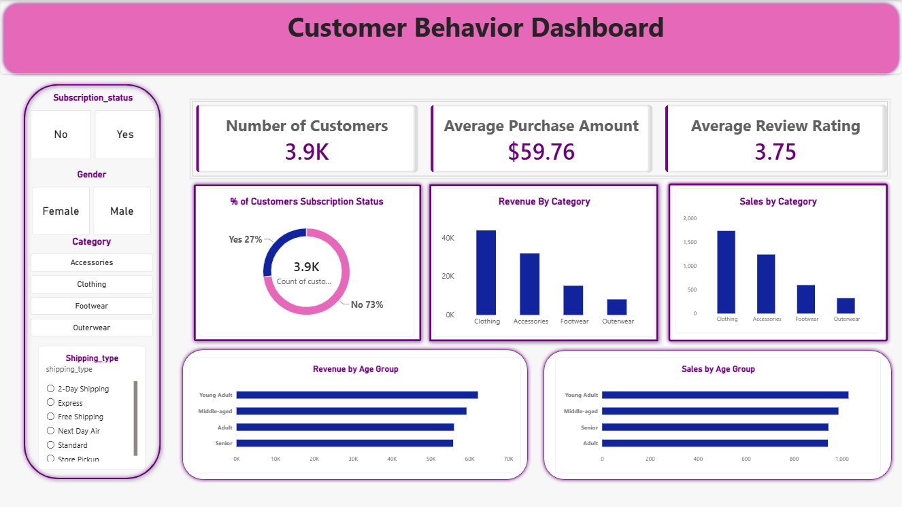

 🛍️ Customer Shopping Behavior Analysis

An end-to-end data analytics project — from raw data to business insights — using **Python, SQL, and Power BI** to uncover customer purchasing patterns for a retail business.

 📌 Project Overview

This project analyzes 3,900 retail customer transactions to answer key business questions around revenue, customer segmentation, product performance, and subscription behavior — then presents the findings in an interactive Power BI dashboard.

The goal:turn raw transactional data into actionable insights a retail business could use to guide marketing, inventory, and loyalty decisions.

 🧰 Tools & Skills Demonstrated

| Area | Tools / Skills |
|---|---|
| Data Cleaning & Feature Engineering | Python (pandas, numpy) |
| Database & Querying | PostgreSQL, SQL (aggregations, CTEs, window functions) |
| Data Visualization | Power BI (DAX, interactive dashboards) |
| Workflow | End-to-end pipeline: raw CSV → cleaned data → SQL analysis → BI dashboard |

 🔍 Key Business Questions Answered

- Which customer segment (gender, age, subscription status) drives the most revenue?
- Do subscribers spend more than non-subscribers?
- Which products have the highest ratings and highest discount usage?
- How can customers be segmented into **New, Returning, and Loyal** tiers?
- What are the top-performing products within each category?
- Are repeat buyers more likely to subscribe?

*(Full list of 10 SQL queries in [`Customer_behavior.sql`](./Customer_behavior.sql))*

📊 Dashboard Highlights

The Power BI dashboard lets users filter by **subscription status, gender, category, and shipping type**, and surfaces:

- 📈 Revenue & sales by product category
- 👥 Revenue & sales by age group
- 💳 Subscription status breakdown
- ⭐ Average purchase amount & review rating at a glance

 🗂️ Project Files

| File | Description |
|---|---|
| [`customer_shopping_behavior.csv`](./customer_shopping_behavior.csv) | Raw dataset (3,900 records) |
| [`Customer_behavior.ipynb`](./Customer_behavior.ipynb) | Data cleaning & feature engineering |
| [`Customer_behavior.sql`](./Customer_behavior.sql) | Business analysis queries |
| [`Dashboard.pbix`](./Dashboard.pbix) | Interactive Power BI dashboard |

 ⚙️ Process

1. Clean & Prepare (Python)
Handled missing review ratings, standardized column formatting, engineered new features (age groups, purchase frequency in days), and removed a redundant column — then loaded the cleaned dataset into PostgreSQL.

2. Analyze (SQL)
Wrote 10 analytical queries covering revenue breakdowns, customer segmentation, and product performance using aggregations, subqueries, CTEs, and window functions.

3. Visualize (Power BI)
Built an interactive dashboard with slicers and KPI cards to make insights accessible to non-technical stakeholders.

 📁 Dataset

3,900 customer transaction records including age, gender, category, purchase amount, review rating, subscription status, shipping type, discount usage, and purchase history.

 🚀 How to Run This Project

1. Clone the repo
2. Run `Customer_behavior.ipynb` to clean the data (update PostgreSQL credentials if loading to a database)
3. Run `Customer_behavior.sql` to reproduce the analysis
4. Open `Dashboard.pbix` in Power BI Desktop to explore the dashboard

 📬 Contact

Feel free to connect if you'd like to discuss this project or potential opportunities!
